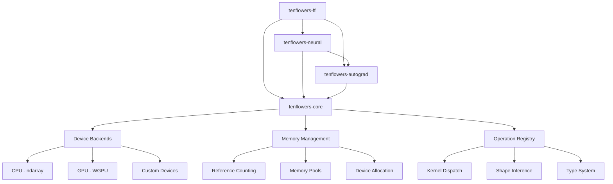
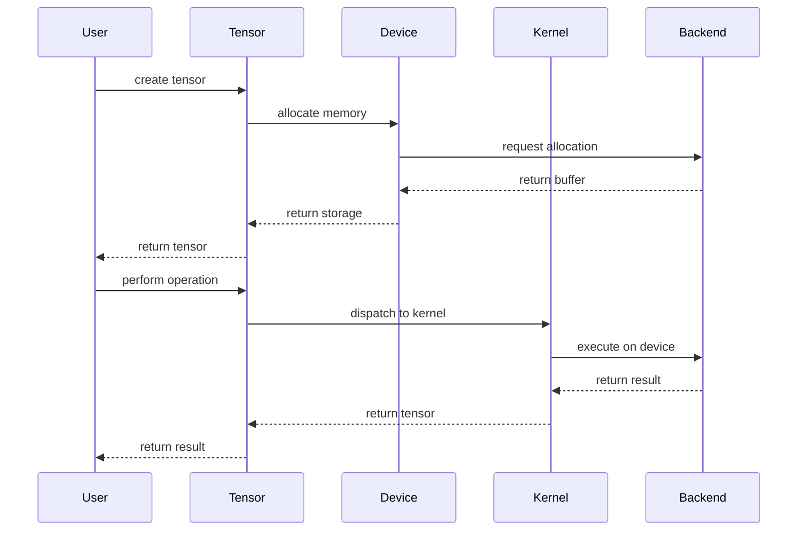
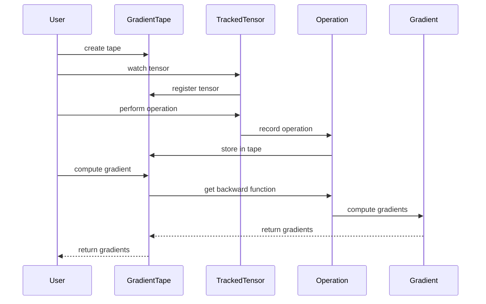

# TenfloweRS Architecture Guide

This guide provides a comprehensive overview of TenfloweRS's architecture, design decisions, and how different components work together to provide a complete machine learning framework.

## Table of Contents

- [Overview](#overview)
- [Design Principles](#design-principles)
- [Core Architecture](#core-architecture)
- [Module Structure](#module-structure)
- [Data Flow](#data-flow)
- [Memory Management](#memory-management)
- [Device Abstraction](#device-abstraction)
- [Execution Modes](#execution-modes)
- [Automatic Differentiation](#automatic-differentiation)
- [Neural Network Layer System](#neural-network-layer-system)
- [Optimization and Performance](#optimization-and-performance)
- [Interoperability](#interoperability)

---

## Overview

TenfloweRS is a pure Rust implementation of TensorFlow's core concepts, designed to provide a safe, performant, and ergonomic machine learning framework. It combines the flexibility of eager execution with the performance benefits of static computation graphs, all while maintaining Rust's memory safety guarantees.

### Key Design Goals

1. **Memory Safety**: Leverage Rust's ownership system to eliminate memory-related bugs
2. **Performance**: Match or exceed TensorFlow's performance through zero-cost abstractions
3. **Ergonomics**: Provide an intuitive API that feels natural to Rust developers
4. **Compatibility**: Maintain conceptual compatibility with TensorFlow while embracing Rust idioms
5. **Extensibility**: Allow easy addition of new operations, devices, and optimizations

---

## Design Principles

### 1. **Rust-First Design**

TenfloweRS is not a port of TensorFlow—it's a reimagining of TensorFlow's concepts in Rust:

```rust
// TensorFlow (Python)
x = tf.Variable([1.0, 2.0, 3.0])
y = tf.square(x)

// TenfloweRS (Rust)
let x = Tensor::from_vec(vec![1.0, 2.0, 3.0], &[3]);
let y = x.pow(&Tensor::from_scalar(2.0))?;
```

### 2. **Zero-Cost Abstractions**

High-level APIs compile down to efficient machine code:

```rust
// This high-level code...
let result = tensor_a.matmul(&tensor_b)?.relu()?;

// ...compiles to efficient kernel calls with no runtime overhead
```

### 3. **Explicit Error Handling**

All operations return `Result<T, TensorError>` for explicit error handling:

```rust
match tensor.reshape(&[2, 3]) {
    Ok(reshaped) => { /* success */ },
    Err(TensorError::ShapeMismatch { expected, actual }) => { /* handle error */ },
}
```

### 4. **Ownership and Borrowing**

Tensors use reference counting for efficient memory management:

```rust
let tensor = Tensor::from_vec(vec![1.0, 2.0], &[2]);
let view = tensor.view(); // No copy, just a view
let clone = tensor.clone(); // Reference count increment
```

---

## Core Architecture

### High-Level Structure

```
┌─────────────────────────────────────────────────────────────┐
│                    TenfloweRS Framework                     │
├─────────────────────────────────────────────────────────────┤
│  Python FFI  │  C API  │  Rust API  │  Other Language FFI  │
├─────────────────────────────────────────────────────────────┤
│            Neural Network Layer (tenflowers-neural)         │
├─────────────────────────────────────────────────────────────┤
│         Automatic Differentiation (tenflowers-autograd)     │
├─────────────────────────────────────────────────────────────┤
│              Core Tensor Operations (tenflowers-core)       │
├─────────────────────────────────────────────────────────────┤
│  CPU Backend  │  GPU Backend  │  Other Device Backends     │
├─────────────────────────────────────────────────────────────┤
│    ndarray    │    WGPU      │    Custom Implementations   │
└─────────────────────────────────────────────────────────────┘
```

### Component Relationships



---

## Module Structure

### 1. **tenflowers-core**

The foundational module providing core tensor operations and infrastructure.

```rust
// Core components
pub struct Tensor<T> {
    storage: Arc<TensorStorage<T>>,
    shape: Shape,
    device: Device,
    dtype: DType,
}

pub enum TensorStorage<T> {
    Cpu(ArrayD<T>),
    #[cfg(feature = "gpu")]
    Gpu(GpuBuffer<T>),
}
```

**Key Responsibilities:**
- Tensor data structure and storage
- Operation registry and dispatch
- Device management
- Memory allocation and management
- Shape inference
- Graph construction (static mode)

### 2. **tenflowers-autograd**

Automatic differentiation engine supporting both eager and graph modes.

```rust
pub struct GradientTape {
    operations: Vec<Operation>,
    tracked_tensors: HashMap<TensorId, TrackedTensor>,
}

pub struct TrackedTensor {
    tensor: Tensor<f32>,
    tape: Arc<GradientTape>,
    requires_grad: bool,
}
```

**Key Responsibilities:**
- Gradient computation
- Tape-based differentiation
- Higher-order derivatives
- Custom gradient definitions
- Integration with graph mode

### 3. **tenflowers-neural**

High-level neural network APIs and training utilities.

```rust
pub trait Layer<T> {
    fn forward(&self, input: &Tensor<T>) -> Result<Tensor<T>>;
    fn parameters(&self) -> Vec<&Tensor<T>>;
    fn set_training(&mut self, training: bool);
}

pub trait Model<T> {
    fn forward(&self, input: &Tensor<T>) -> Result<Tensor<T>>;
    fn train_step(&mut self, input: &Tensor<T>, target: &Tensor<T>, optimizer: &mut dyn Optimizer<T>) -> Result<Tensor<T>>;
}
```

**Key Responsibilities:**
- Neural network layers
- Model abstractions
- Training loops
- Optimizers
- Loss functions and metrics

### 4. **tenflowers-dataset**

Data loading and preprocessing utilities.

```rust
pub trait Dataset<T> {
    type Item;
    fn get(&self, index: usize) -> Result<Self::Item>;
    fn len(&self) -> usize;
}

pub struct DataLoader<D: Dataset<T>, T> {
    dataset: D,
    batch_size: usize,
    shuffle: bool,
    num_workers: usize,
}
```

**Key Responsibilities:**
- Data loading abstractions
- Batch processing
- Data transformations
- Synthetic data generation

### 5. **tenflowers-ffi**

Foreign function interface for Python and C integration.

```rust
#[pyclass]
pub struct PyTensor {
    inner: Tensor<f32>,
}

#[pymethods]
impl PyTensor {
    #[new]
    fn new(data: Vec<f32>, shape: Vec<usize>) -> Self {
        // Implementation
    }
}
```

**Key Responsibilities:**
- Python bindings via PyO3
- C API for other languages
- NumPy interoperability
- Type conversion helpers

---

## Data Flow

### Tensor Creation and Operations



### Gradient Computation Flow



---

## Memory Management

### Reference Counting

Tensors use `Arc<TensorStorage<T>>` for efficient reference counting:

```rust
pub struct Tensor<T> {
    storage: Arc<TensorStorage<T>>,  // Shared ownership
    shape: Shape,
    device: Device,
    dtype: DType,
}
```

**Benefits:**
- Automatic memory management
- Efficient tensor views
- No garbage collection overhead
- Predictable memory usage

### Memory Pools

For frequently allocated tensors:

```rust
pub struct MemoryPool {
    buffers: HashMap<(usize, Device), Vec<Buffer>>,
    allocator: Box<dyn Allocator>,
}
```

**Features:**
- Reduces allocation overhead
- Decreases memory fragmentation
- Device-specific pools
- Configurable pool sizes

### Zero-Copy Operations

Many operations avoid copying data:

```rust
impl<T> Tensor<T> {
    pub fn view(&self) -> TensorView<T> {
        TensorView {
            storage: self.storage.clone(),  // Reference count increment
            shape: self.shape.clone(),
            offset: 0,
            strides: self.strides.clone(),
        }
    }
}
```

---

## Device Abstraction

### Device Hierarchy

```rust
#[derive(Debug, Clone, PartialEq)]
pub enum Device {
    Cpu,
    Gpu(usize),  // GPU ID
    Custom(String),
}

pub trait DeviceBackend {
    type Buffer;
    
    fn allocate(&self, size: usize) -> Result<Self::Buffer>;
    fn deallocate(&self, buffer: Self::Buffer);
    fn copy_to(&self, src: &Self::Buffer, dst: &mut Self::Buffer, size: usize) -> Result<()>;
    fn copy_from(&self, src: &Self::Buffer, dst: &mut [u8]) -> Result<()>;
}
```

### CPU Backend

Built on ndarray for mature, optimized CPU operations:

```rust
pub struct CpuBackend;

impl DeviceBackend for CpuBackend {
    type Buffer = ArrayD<f32>;
    
    fn allocate(&self, shape: &[usize]) -> Result<Self::Buffer> {
        Ok(ArrayD::zeros(shape))
    }
}
```

### GPU Backend

Uses WGPU for cross-platform GPU compute:

```rust
pub struct GpuBackend {
    device: wgpu::Device,
    queue: wgpu::Queue,
    compute_pipeline: wgpu::ComputePipeline,
}

impl DeviceBackend for GpuBackend {
    type Buffer = wgpu::Buffer;
    
    fn allocate(&self, size: usize) -> Result<Self::Buffer> {
        Ok(self.device.create_buffer(&wgpu::BufferDescriptor {
            label: Some("tensor_buffer"),
            size: size as u64,
            usage: wgpu::BufferUsages::STORAGE | wgpu::BufferUsages::COPY_SRC,
            mapped_at_creation: false,
        }))
    }
}
```

### Device Placement Strategy

```rust
pub struct DevicePlacement {
    strategy: PlacementStrategy,
    device_capabilities: HashMap<Device, DeviceCapabilities>,
}

pub enum PlacementStrategy {
    Manual,
    Automatic,
    CostModel(CostModel),
}
```

---

## Execution Modes

### Eager Execution

Operations execute immediately:

```rust
let a = Tensor::from_vec(vec![1.0, 2.0], &[2]);
let b = Tensor::from_vec(vec![3.0, 4.0], &[2]);
let c = &a + &b;  // Executes immediately
```

**Characteristics:**
- Immediate execution
- Easy debugging
- Interactive development
- Pythonic feel

### Graph Mode

Operations build a computation graph:

```rust
let mut graph = Graph::new();
let a = graph.placeholder("a", DType::F32, Some(&[2]));
let b = graph.placeholder("b", DType::F32, Some(&[2]));
let c = graph.add(&a, &b)?;

let session = Session::new(&graph);
let result = session.run(&[c], &[("a", &tensor_a), ("b", &tensor_b)])?;
```

**Characteristics:**
- Deferred execution
- Global optimization
- Better performance
- Deployment-friendly

### Unified Approach

TenfloweRS allows mixing both modes:

```rust
// Eager mode for development
let model = build_model_eagerly();

// Convert to graph mode for production
let graph = model.to_graph()?;
let optimized_graph = optimizer.optimize(&graph)?;
let session = Session::new(&optimized_graph);
```

---

## Automatic Differentiation

### Forward Mode

Efficient for functions with few inputs:

```rust
pub struct DualNumber<T> {
    value: T,
    derivative: T,
}

impl<T> DualNumber<T> {
    pub fn new(value: T, derivative: T) -> Self {
        Self { value, derivative }
    }
}
```

### Reverse Mode

Efficient for functions with many inputs (typical in ML):

```rust
pub struct GradientTape {
    operations: Vec<Operation>,
    gradients: HashMap<TensorId, Tensor<f32>>,
}

impl GradientTape {
    pub fn backward(&mut self, output: &TrackedTensor) -> Result<()> {
        // Reverse-mode differentiation
        for op in self.operations.iter().rev() {
            op.backward(self)?;
        }
        Ok(())
    }
}
```

### Higher-Order Derivatives

```rust
pub fn hessian<F>(input: &Tensor<f32>, f: F) -> Result<Tensor<f32>>
where
    F: Fn(&Tensor<f32>) -> Result<Tensor<f32>>,
{
    let tape1 = GradientTape::new();
    let input_tracked = tape1.watch(input.clone());
    let output = f(&input_tracked)?;
    
    let first_grad = tape1.gradient(&output, &[&input_tracked])?[0].clone();
    
    let tape2 = GradientTape::new();
    let grad_tracked = tape2.watch(first_grad);
    let second_grad = tape2.gradient(&grad_tracked.sum(None)?, &[&input_tracked])?;
    
    Ok(second_grad[0].clone())
}
```

---

## Neural Network Layer System

### Layer Trait

```rust
pub trait Layer<T> {
    fn forward(&self, input: &Tensor<T>) -> Result<Tensor<T>>;
    fn parameters(&self) -> Vec<&Tensor<T>>;
    fn parameters_mut(&mut self) -> Vec<&mut Tensor<T>>;
    fn set_training(&mut self, training: bool);
    fn training(&self) -> bool;
}
```

### Implementation Example

```rust
pub struct Dense<T> {
    weight: Tensor<T>,
    bias: Option<Tensor<T>>,
    activation: Option<ActivationFunction>,
    training: bool,
}

impl<T> Layer<T> for Dense<T>
where
    T: Clone + Default + 'static,
{
    fn forward(&self, input: &Tensor<T>) -> Result<Tensor<T>> {
        let mut output = input.matmul(&self.weight)?;
        
        if let Some(ref bias) = self.bias {
            output = output.add(bias)?;
        }
        
        if let Some(ref activation) = self.activation {
            output = activation.apply(&output)?;
        }
        
        Ok(output)
    }
    
    fn parameters(&self) -> Vec<&Tensor<T>> {
        let mut params = vec![&self.weight];
        if let Some(ref bias) = self.bias {
            params.push(bias);
        }
        params
    }
}
```

### Model Composition

```rust
pub struct Sequential<T> {
    layers: Vec<Box<dyn Layer<T>>>,
    training: bool,
}

impl<T> Model<T> for Sequential<T> {
    fn forward(&self, input: &Tensor<T>) -> Result<Tensor<T>> {
        let mut output = input.clone();
        for layer in &self.layers {
            output = layer.forward(&output)?;
        }
        Ok(output)
    }
}
```

---

## Optimization and Performance

### Kernel Fusion

Combine multiple operations into single kernels:

```rust
pub struct FusedKernel {
    operations: Vec<Operation>,
    fused_shader: String,
}

impl FusedKernel {
    pub fn fuse(ops: &[Operation]) -> Result<Self> {
        let mut shader = String::new();
        for op in ops {
            shader.push_str(&op.shader_code());
        }
        
        Ok(Self {
            operations: ops.to_vec(),
            fused_shader: shader,
        })
    }
}
```

### Graph Optimization

```rust
pub struct GraphOptimizer {
    passes: Vec<Box<dyn OptimizationPass>>,
}

pub trait OptimizationPass {
    fn apply(&self, graph: &mut Graph) -> Result<bool>;
}

pub struct ConstantFolding;
impl OptimizationPass for ConstantFolding {
    fn apply(&self, graph: &mut Graph) -> Result<bool> {
        // Fold constant expressions
        Ok(true)
    }
}
```

### Memory Optimization

```rust
pub struct MemoryOptimizer {
    strategy: MemoryStrategy,
}

pub enum MemoryStrategy {
    MinimizeMemory,
    MinimizeRecomputation,
    Balanced,
}
```

### SIMD Vectorization

```rust
use std::simd::{f32x4, SimdFloat};

pub fn vectorized_add(a: &[f32], b: &[f32], result: &mut [f32]) {
    let chunks = a.len() / 4;
    
    for i in 0..chunks {
        let va = f32x4::from_slice(&a[i * 4..]);
        let vb = f32x4::from_slice(&b[i * 4..]);
        let vr = va + vb;
        vr.copy_to_slice(&mut result[i * 4..]);
    }
    
    // Handle remainder
    for i in chunks * 4..a.len() {
        result[i] = a[i] + b[i];
    }
}
```

---

## Interoperability

### NumPy Integration

```rust
use numpy::PyArray1;
use pyo3::prelude::*;

#[pymethods]
impl PyTensor {
    #[new]
    fn from_numpy(array: &PyArray1<f32>) -> Self {
        let tensor = Tensor::from_slice(array.as_slice().unwrap(), array.shape());
        Self { inner: tensor }
    }
    
    fn to_numpy(&self) -> Py<PyArray1<f32>> {
        // Convert to NumPy array
    }
}
```

### ONNX Support

```rust
pub struct OnnxExporter {
    model: Box<dyn Model<f32>>,
}

impl OnnxExporter {
    pub fn export(&self, path: &str) -> Result<()> {
        let graph = self.model.to_graph()?;
        let onnx_graph = self.convert_to_onnx(&graph)?;
        onnx_graph.save(path)?;
        Ok(())
    }
}
```

### C API

```c
typedef struct TensorHandle TensorHandle;

TensorHandle* tensor_create(const float* data, const size_t* shape, size_t ndim);
void tensor_destroy(TensorHandle* tensor);
TensorHandle* tensor_add(const TensorHandle* a, const TensorHandle* b);
```

---

## Error Handling and Debugging

### Error Types

```rust
#[derive(Debug, thiserror::Error)]
pub enum TensorError {
    #[error("Shape mismatch: expected {expected:?}, got {actual:?}")]
    ShapeMismatch { expected: Vec<usize>, actual: Vec<usize> },
    
    #[error("Device error: {0}")]
    DeviceError(String),
    
    #[error("Computation error: {0}")]
    ComputationError(String),
    
    #[error("Memory error: {0}")]
    MemoryError(String),
}
```

### Debugging Support

```rust
pub struct DebugContext {
    enabled: bool,
    trace_operations: bool,
    print_intermediate: bool,
}

impl DebugContext {
    pub fn trace_operation(&self, op: &Operation, inputs: &[&Tensor<f32>]) {
        if self.trace_operations {
            println!("Operation: {:?}", op);
            for (i, input) in inputs.iter().enumerate() {
                println!("  Input {}: {:?}", i, input.shape());
            }
        }
    }
}
```

---

## Future Directions

### Planned Enhancements

1. **XLA Integration**: JIT compilation for maximum performance
2. **Distributed Training**: Multi-node training support
3. **Quantization**: INT8/INT4 inference optimization
4. **WebAssembly**: Browser deployment support
5. **Mobile**: iOS/Android deployment
6. **Custom Backends**: Support for specialized hardware

### Research Areas

1. **Automatic Mixed Precision**: Smarter FP16/FP32 decisions
2. **Dynamic Shapes**: Better support for variable-sized inputs
3. **Sparse Tensors**: Efficient sparse computation
4. **Federated Learning**: Privacy-preserving ML
5. **Neural Architecture Search**: Automated model design

---

## Conclusion

TenfloweRS represents a modern approach to machine learning frameworks, combining the performance and safety of Rust with the proven architectural patterns of TensorFlow. Its modular design allows for easy extension and customization while maintaining high performance through careful attention to memory management and optimization.

The framework's dual execution modes, comprehensive autograd system, and device abstraction make it suitable for both research and production use cases. As the Rust ecosystem continues to grow, TenfloweRS is positioned to become a key component in the scientific computing and machine learning toolkit.

For more detailed information about specific components, refer to the API documentation and individual module guides.